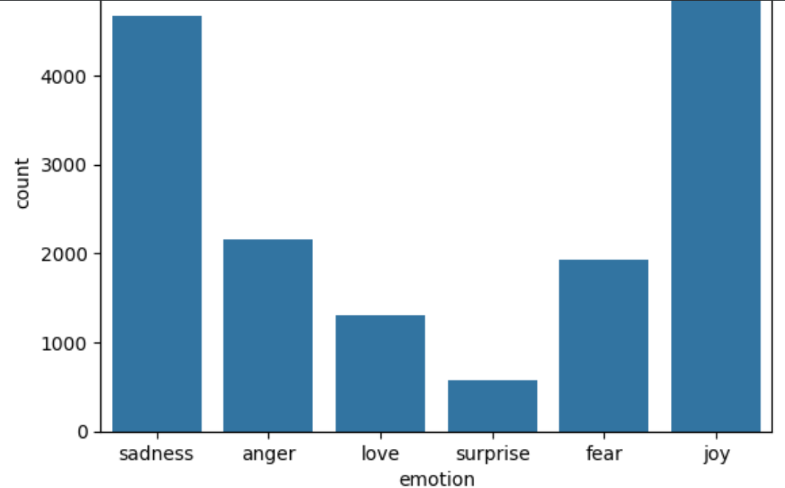
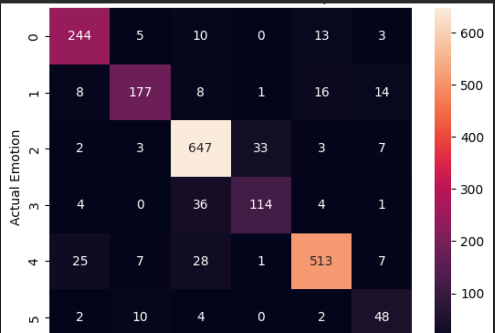
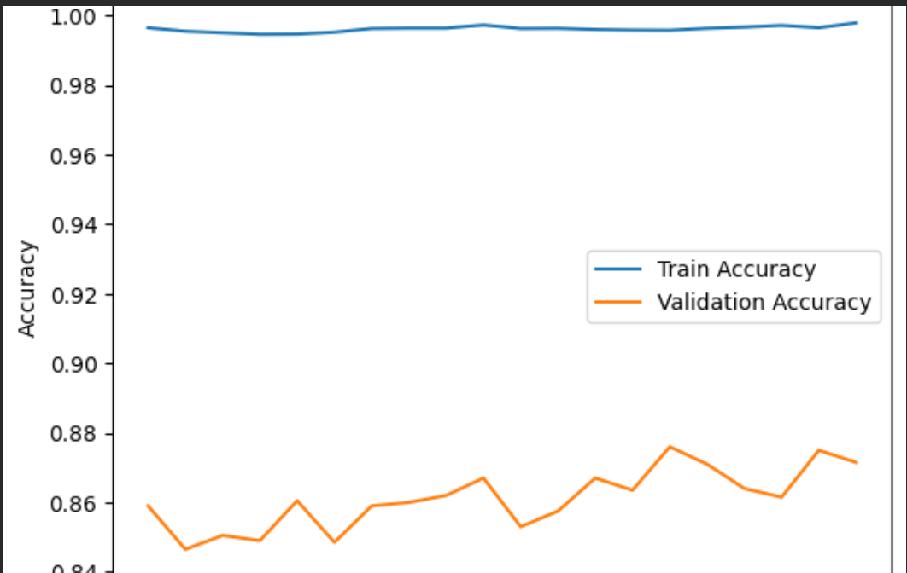
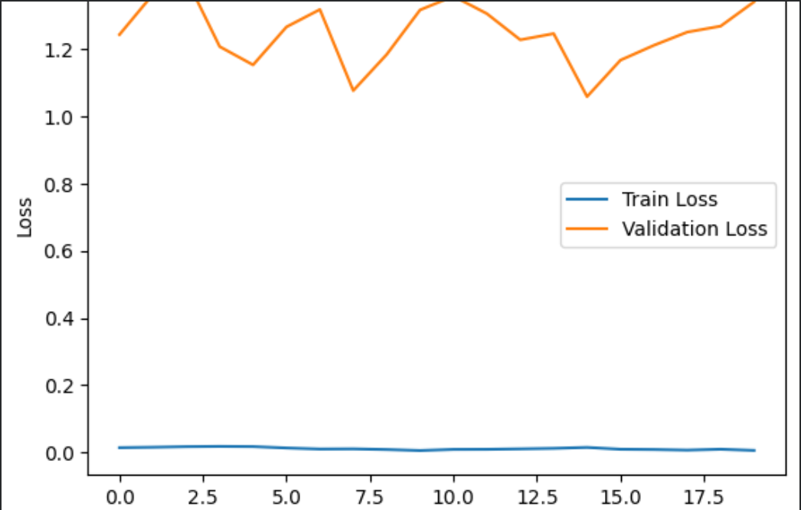
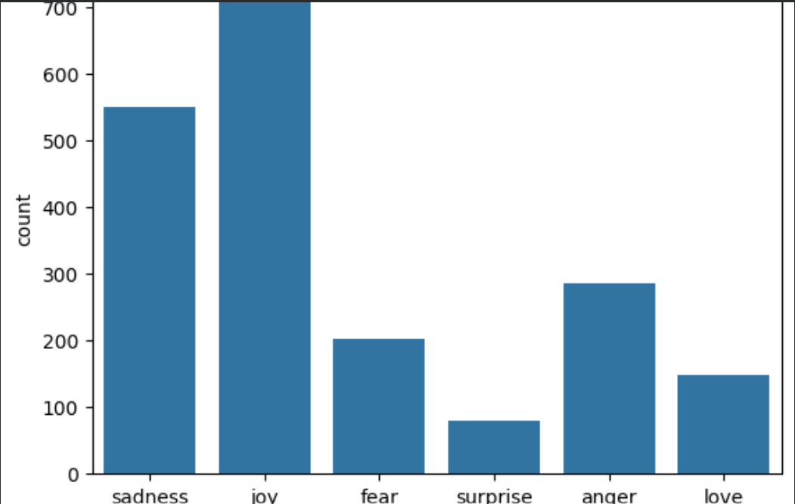

# Emotion Detection using AI

##  Project Overview
This project is part of my internship at **Skillerz Hub**.  
It focuses on building a machine learning model that classifies text into emotions such as **joy, sadness, anger, fear, love, and surprise**.  
The project uses **TF‑IDF features** with a **neural network** and includes a **bonus demo** powered by Hugging Face Transformers.

---

##  Features
- Preprocessing text data with TF‑IDF
- Neural network model built using TensorFlow/Keras
- Evaluation with classification report and confusion matrix
- Visualizations: dataset distribution, accuracy/loss curves, prediction histogram
- Bonus demo with Hugging Face pipeline for instant emotion detection

---

## Tech Stack
**Programming Language(s):** Python  
**Libraries/Tools:** TensorFlow, Keras, Scikit‑Learn, Matplotlib, Seaborn, Hugging Face Transformers  
**Environment:** Google Colab  

---

## Visual Outputs

### Dataset Distribution

### Confusion Matrix Heatmap

### Model Accuracy

### Model Loss

### Predicted Emotion Counts

---

## Results
- **Accuracy:** ~87%  
- Balanced precision, recall, and F1‑scores across most emotion categories  
- Strong diagonal in confusion matrix showing correct predictions

---

## Bonus Demo
Quick emotion detection using Hugging Face pre‑trained model:

-python

from transformers import pipeline

emotion_model = pipeline("text-classification", model="j-hartmann/emotion-english-distilroberta-base")
print(emotion_model("I am really happy today!"))
